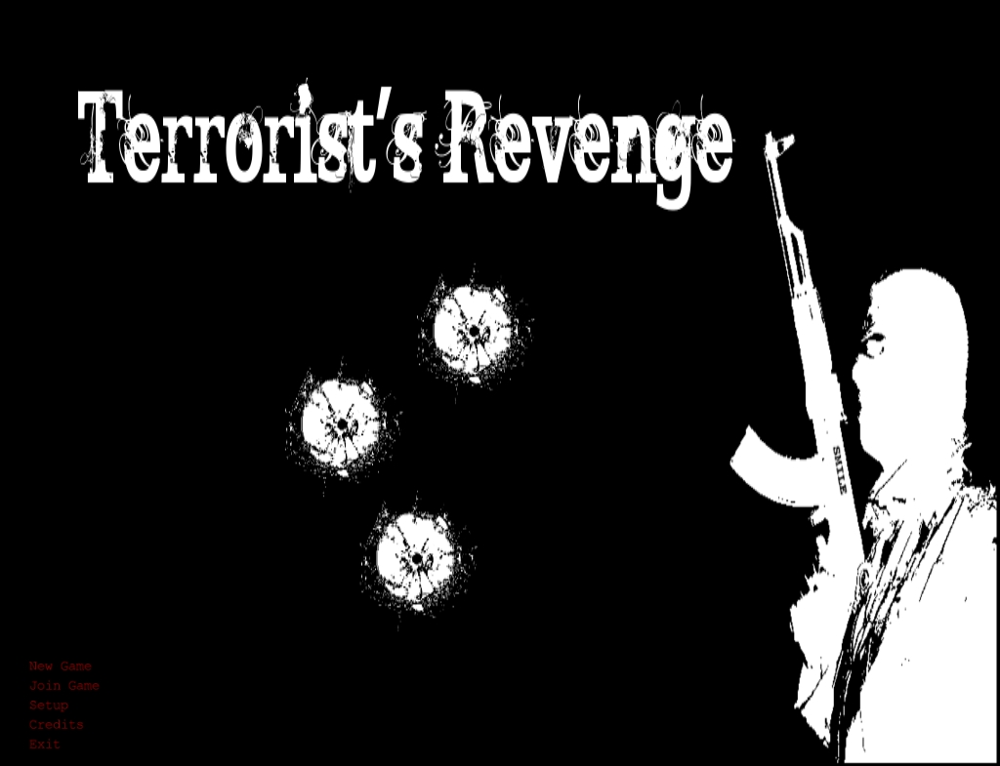
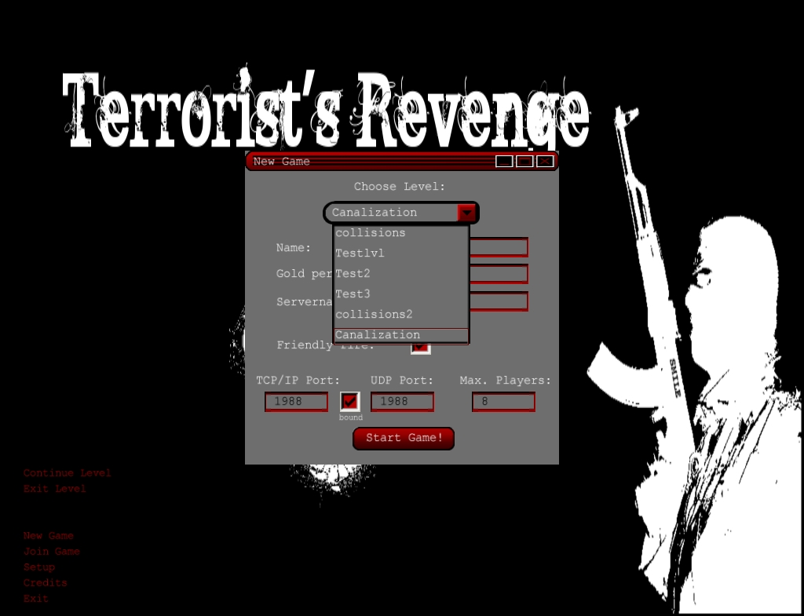
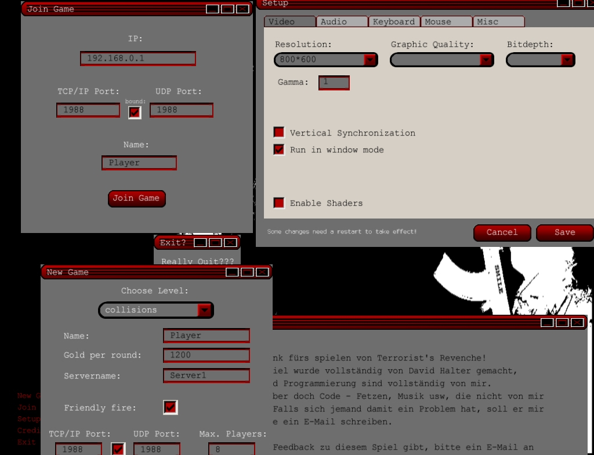
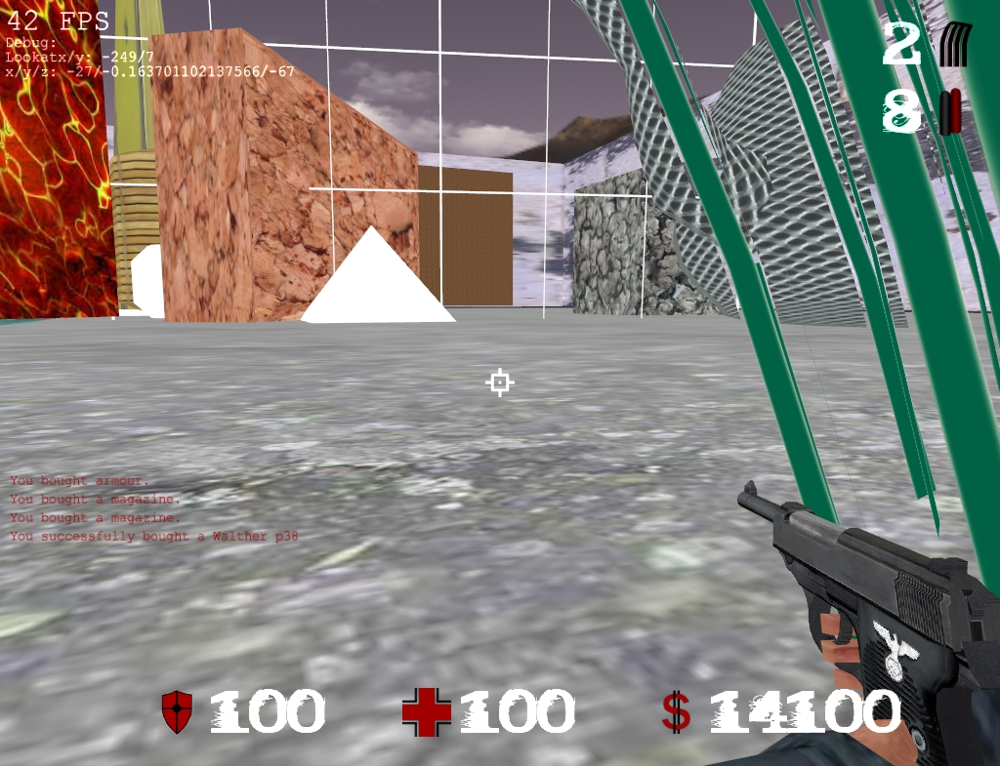
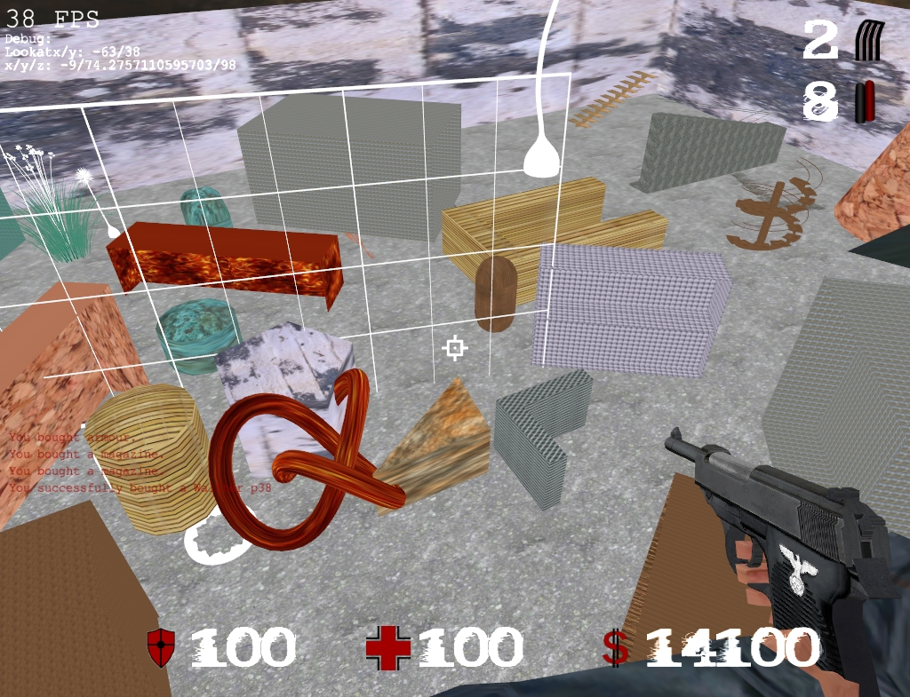
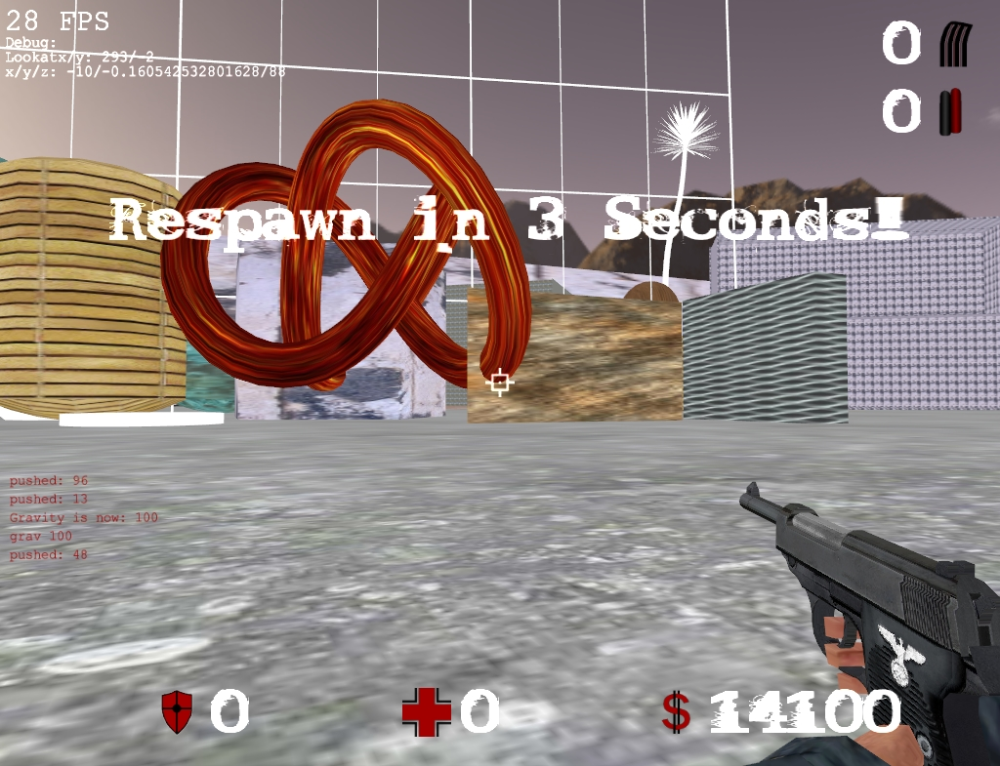
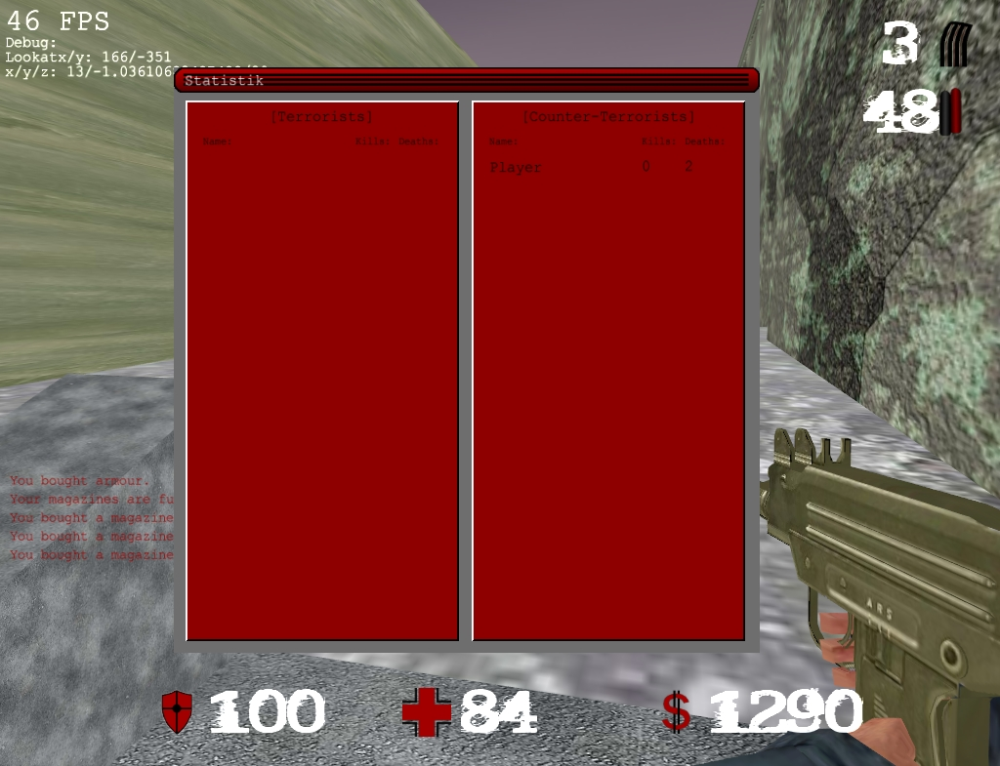
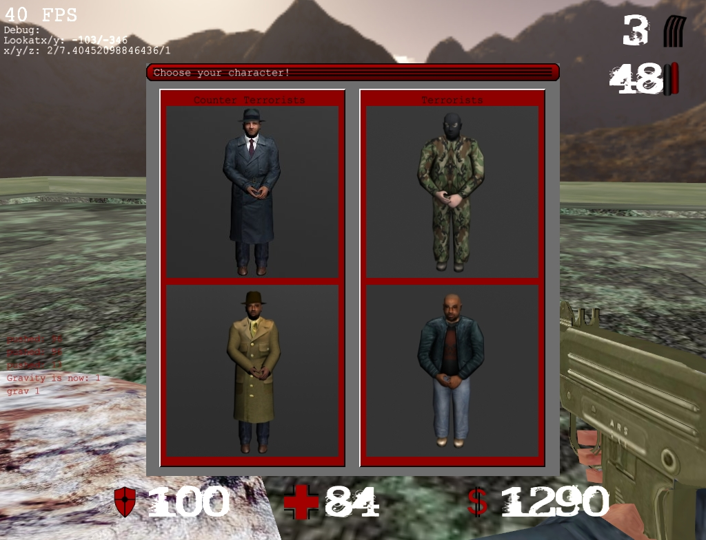
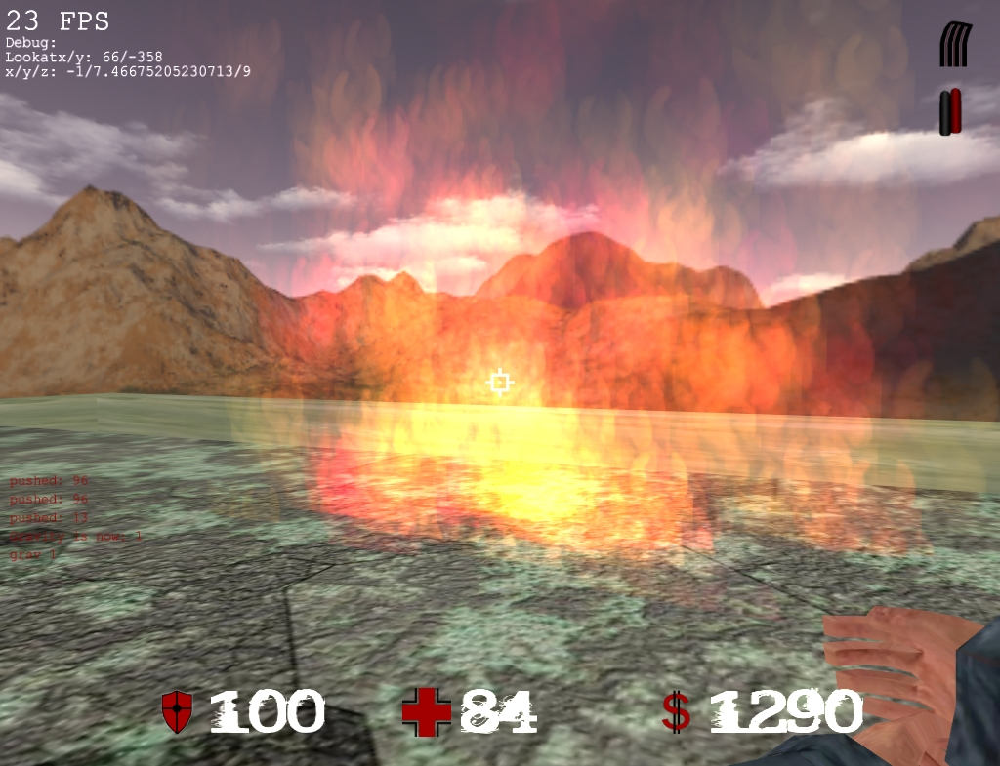
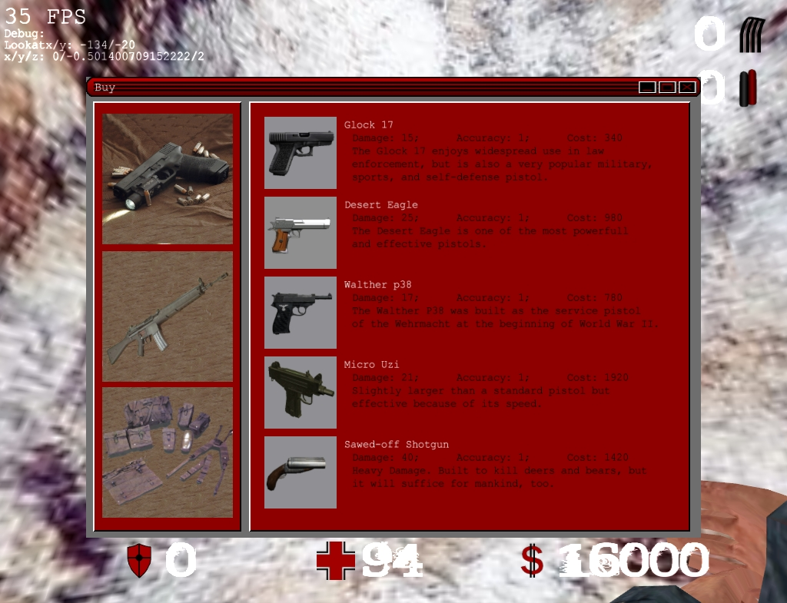

public: yes
tags: [game, delphi, gui, matura]
summary: High school thesis finished

Maturaarbeit fertiggestellt
===========================

.. note ::

    This is about a game I once wrote, which was part of my high school
    thesis. Unfortunately, it's written in German.

Vor ein paar Wochen habe ich meine Maturaarbeit fertiggestellt. Nun werde ich das
Spiel selbst aber erst nach der Präsentation freigeben. Das liegt daran, dass
ich noch mindestens zwei Dinge tun muss: Partikelausrichtung und die
Erweiterung des Netzwerks für 3 und mehr Personen. Ich hoffe, dass das ganze
auch bald funktioniert, wenn nicht auch egal.

Hier noch ein paar Bilder:

.. image:: screen2.jpg
   :align: center

.. image:: screen7.jpg
   :align: center

